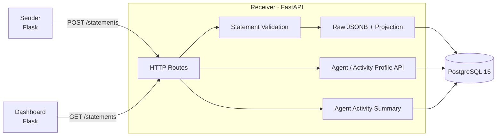
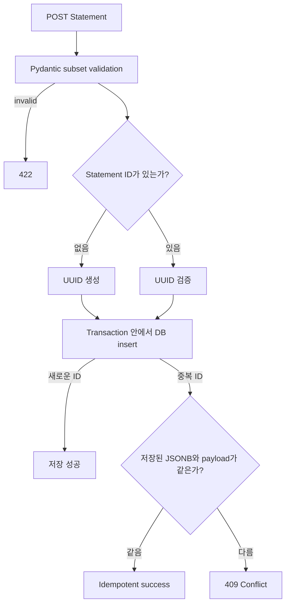
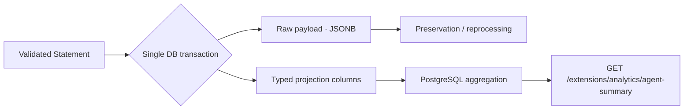

# lrs-lite

`lrs-lite`는 Learning Record Store의 핵심 구조를 직접 다시 구현하며 이해하기 위해 시작한 개인 Backend Engineering 프로젝트입니다. 실무에서 LRS를 구축하고 운영한 경험을 바탕으로, xAPI 형태의 학습 이벤트가 수집부터 영속화, Profile Document, Analytics까지 어떻게 이어지는지를 구현했습니다.

이 프로젝트는 xAPI 전체 규격을 구현한 LRS가 아닙니다. 데이터 정합성, HTTP concurrency, transaction 일관성, **Raw Data Preservation**에 초점을 맞춘 xAPI subset 구현입니다.

## 1. 프로젝트 소개

하나의 예제 API에 그치지 않고 작은 학습 기록 시스템의 전체 흐름을 연결했습니다.

- Sender에서 퀴즈 기반 xAPI Statement를 생성합니다.
- FastAPI Receiver가 Statement를 검증하고 저장합니다.
- PostgreSQL은 검증된 Statement를 JSONB로 보존하면서 조회용 Projection을 함께 관리합니다.
- Agent / Activity Profile API는 optimistic concurrency를 적용해 임의 형식의 문서를 저장합니다.
- Analytics API는 Agent 활동을 PostgreSQL에서 직접 집계합니다.
- Dashboard에서는 최근 적재된 Statement와 raw payload를 확인할 수 있습니다.

핵심 설계 원칙은 원본 이벤트 필드를 보존하는 것입니다. 조회 모델이나 Analytics가 변경되어도 저장된 JSONB payload를 다시 작성하지 않습니다.

## 2. 아키텍처



| 구성 요소 | 역할 | Local port |
| --- | --- | ---: |
| Sender | 샘플 Statement 생성, 미리보기, 전송 | `3000` |
| Receiver | Statement, Profile Document, health, Analytics API | `8080` |
| Dashboard | Receiver에서 최근 Statement를 조회해 표시 | `3001` |
| PostgreSQL | Raw Statement, Projection, migration, Profile Document 저장 | `5434` |

## 3. AI Coding Agent 도입 전/후

```text
직접 구현한 MVP → manual-mvp → AI-assisted engineering
```

### Manual MVP (`manual-mvp`)

먼저 AI Coding Agent 없이 LRS의 기본 데이터 흐름을 직접 구현했습니다.

- Flask Sender와 퀴즈 기반 샘플 Statement
- FastAPI Receiver
- PostgreSQL JSONB 기반 raw Statement 저장
- Dashboard와 raw payload 조회
- Sender, Receiver, Dashboard, PostgreSQL의 Docker Compose 구성
- `Sender → Receiver → storage → Dashboard` ingestion flow

Annotated tag인 `manual-mvp`는 이 수동 구현 기준선의 끝을 표시합니다.

### AI-assisted Enhancement

이후 기존 MVP를 기반으로 AI Coding Agent를 활용해 repository 분석, 구현, 테스트 작성, edge case 탐색 속도를 높였습니다. 수동 MVP에서 의도적으로 남겨둔 다음 Backend Engineering 문제를 고도화했습니다.

- Statement subset validation, UUID 생성, DB constraint
- 재요청 idempotency와 동일 ID의 다른 payload conflict
- 명시적인 SQL migration과 안전한 backfill
- Agent / Activity Profile Document API
- canonical Agent identity와 owner 단위 uniqueness
- ETag, conditional request, JSON merge, concurrent write
- Statement Projection과 Agent Activity Analytics의 transaction 일관성
- integration test와 로컬 성능 측정

AI Coding Agent가 설계를 대신 결정하도록 두지는 않았습니다. 지원할 xAPI 범위, migration 정책, conflict semantics, transaction 경계, canonical identity 규칙, index 설계, cache 및 비동기 인프라 도입 여부는 직접 검토했습니다.

## 4. Statement Integrity

Receiver는 현재 Sender가 생성하는 subset을 검증합니다. `mbox`로 식별되는 Agent, Verb IRI, Activity IRI를 필수로 확인하며 Context와 Result, score constraint, timezone이 포함된 timestamp를 선택적으로 지원합니다. 정의하지 않은 xAPI 속성도 조용히 제거하지 않고 보존합니다.



`statement_id`는 `UUID NOT NULL UNIQUE` 컬럼입니다. DB uniqueness constraint가 concurrent duplicate insert를 최종적으로 방어하고, payload 비교를 통해 안전한 재요청과 동일 ID를 다른 내용에 재사용한 요청을 구분합니다.

## 5. Profile Document API

Profile 기능은 JSON 전용 CRUD가 아니라 xAPI Document API의 핵심 동작을 구현합니다.

| Resource | Methods |
| --- | --- |
| `/agents/profile` | `PUT`, `POST`, `GET`, `DELETE` |
| `/activities/profile` | `PUT`, `POST`, `GET`, `DELETE` |

주요 설계는 다음과 같습니다.

- Document body를 `BYTEA`로 저장해 arbitrary Content-Type을 지원합니다.
- 저장한 Content-Type을 문서와 함께 반환합니다.
- Agent의 표시 이름과 무관한 canonical key로 owner를 식별합니다.
- 현재 subset은 `mbox`를 지원하며, case-insensitive한 domain 부분만 정규화합니다.
- `(resource_type, owner_key, profile_id)`를 DB primary key로 사용합니다.
- GET 응답에 quoted SHA-1 ETag와 `Last-Modified`를 포함합니다.
- `If-Match`로 오래된 문서를 기준으로 한 갱신을 방지합니다.
- `If-None-Match: *`로 create-only 요청을 지원합니다.
- precondition 실패 시 문서를 변경하지 않고 `412`를 반환합니다.
- JSON POST는 top-level에서 merge하며 nested value는 deep merge하지 않고 교체합니다.
- PostgreSQL transaction advisory lock으로 아직 row가 없는 concurrent create를 포함해 동일 문서 key의 작업을 직렬화합니다.

Conditional request 판단과 실제 write가 하나의 transaction 안에서 처리되도록 구성했습니다.

## 6. Raw → Projection → Analytics

검증된 payload는 `payload JSONB`에 유지되며 Analytics가 이를 다시 작성하지 않습니다. Statement를 저장할 때 조회에 필요한 필드를 같은 transaction 안에서 함께 Projection합니다.

```text
actor_key
verb_id
activity_id
event_timestamp
score_scaled
success
completion
```



JSONB는 Projection과 독립적으로 이벤트 필드를 보존하고, typed column은 Analytics query를 단순하고 index 가능한 형태로 만듭니다. 별도 비동기 Projection pipeline이나 Analytics DB를 두지 않고 Statement transaction으로 raw와 Projection의 정합성을 보장했습니다.

Agent Summary는 저장된 값으로 명확하게 계산할 수 있는 항목만 제공합니다.

- 전체 Statement 수
- 최초 및 최근 활동 시각
- Verb / Activity별 Statement 수
- completion, success, failure 수
- `score.scaled` 평균 및 최고값

Score가 없는 Statement는 전체 수에는 포함하지만 score 집계에서는 제외합니다. 집중도나 학습 수준처럼 임의적인 해석이 필요한 지표는 계산하지 않습니다.

## 7. 성능 측정과 기술적 판단

Docker의 PostgreSQL을 사용한 로컬 개발환경에서 간단한 benchmark를 진행했습니다.

| 측정 항목 | 결과 |
| --- | ---: |
| 전체 Statements | 10,000 |
| 대상 Agent Statements | 2,000 |
| API 측정 횟수 | 100 |
| Median | 약 7.5 ms |
| p95 | 약 8.8 ms |
| Core SQL execution | 약 0.66 ms |

API 측정에는 FastAPI TestClient 처리와 실제 PostgreSQL connection이 포함되어 있습니다. 로컬 개발환경의 참고 결과이며 운영 환경의 성능을 보장하는 수치는 아닙니다.

Query에서는 `idx_statements_actor_key`가 사용됐고, 측정된 latency는 Redis 도입을 정당화할 수준이 아니었습니다. 현재 규모에서는 Agent Statement가 저장될 때마다 cache를 무효화하는 일관성 및 운영 복잡성이 얻는 이점보다 크다고 판단했습니다. 실제 workload에서 Summary 조회가 집중되거나 집계 시간이 유의미하게 증가할 때 다시 검토할 수 있습니다.

## 8. 테스트

현재 전체 테스트 결과는 다음과 같습니다.

```text
46 passed
```

테스트 개수보다 DB와 HTTP 경계에서 다음 동작을 실제로 검증하는 데 초점을 맞췄습니다.

- Statement validation과 UUID 생성
- idempotent retry와 다른 payload conflict
- UUID, uniqueness, nullability DB constraint
- migration과 backfill
- Agent identity canonicalization
- Agent / Activity Profile lifecycle
- arbitrary Content-Type round trip
- ETag와 `If-Match` / `If-None-Match` precondition
- top-level JSON POST merge와 잘못된 merge 요청의 rollback
- DB uniqueness와 concurrent create 직렬화
- raw JSONB와 Projection 정합성
- Agent 분리와 Analytics 집계 정확성
- score가 없는 Statement와 idempotent Analytics count

Integration test는 persistence 동작을 in-memory DB로 대체하지 않고 PostgreSQL을 대상으로 실행합니다.

## 9. 지원 범위

### 지원하는 xAPI subset

- 단일 Statement `POST /statements`
- 서버가 생성하거나 client가 제공한 UUID Statement ID
- `mbox`로 식별되는 Agent actor
- Verb / Activity IRI
- Sender가 사용하는 optional Context, Result, score, success, completion, timestamp
- raw JSONB 저장과 transaction 기반 Projection
- `GET /statements`를 통한 최근 Statement 목록
- Agent / Activity Profile Document operation
- arbitrary Profile Content-Type, ETag, `Last-Modified`, conditional mutation
- exclusive `since` 조건을 적용한 Profile ID 목록
- `/extensions/analytics`의 Agent Activity Summary

### 의도적으로 지원하지 않는 범위

- xAPI 전체 규격 준수
- Statement batch ingestion, Statement PUT, 전체 retrieval filter, voiding
- State API
- attachment와 multipart transfer
- 완전한 authentication / authorization
- `mbox` 외 Agent IFI (`account`, `openid`, `mbox_sha1sum`)
- Group, SubStatement, StatementRef
- 완전한 HEAD, content negotiation, xAPI version header 동작
- 전체 ADL LRS conformance suite
- Redis, message queue, background pipeline, 별도 Analytics service

## 10. 로컬 실행 방법

### 사전 요구사항

- Docker 및 Docker Compose

### 애플리케이션 실행

```bash
cp .env.example .env
docker compose up --build
```

접속 주소:

- Sender: [http://localhost:3000](http://localhost:3000)
- Receiver API docs: [http://localhost:8080/docs](http://localhost:8080/docs)
- Receiver health: [http://localhost:8080/health](http://localhost:8080/health)
- Dashboard: [http://localhost:3001](http://localhost:3001)

Receiver는 시작할 때 `receiver/migrations`의 SQL migration을 적용합니다. PostgreSQL 데이터는 `portfolio_data` Docker volume에 유지됩니다.

서비스 종료:

```bash
docker compose down
```

### 테스트 실행

DB를 시작하고 로컬 Python 환경을 구성합니다.

```bash
cp .env.example .env
docker compose up -d db

python3 -m venv .venv
source .venv/bin/activate
pip install -r receiver/requirements-dev.txt

set -a
source .env
set +a
export DB_HOST=127.0.0.1
export DB_PORT=5434

PYTHONPATH=receiver pytest receiver/tests -q
```

## 11. 프로젝트 변경 이력

Git history도 이 프로젝트의 성장 과정을 보여주는 포트폴리오의 일부입니다.

```text
manual-mvp
    ↓
Statement Integrity
    ↓
Agent / Activity Profile Document API
    ↓
Transactional Projection and Agent Analytics
```

`manual-mvp`는 AI Coding Agent 도입 전 직접 구현한 기준선을 표시하는 annotated tag입니다. 이후 commit은 Statement Integrity, Profile Document semantics, Analytics 작업을 구분해 기록했으며, 직접 구현한 MVP에서 검토 가능한 AI-assisted engineering으로 발전한 과정을 Git history에서 확인할 수 있습니다.
