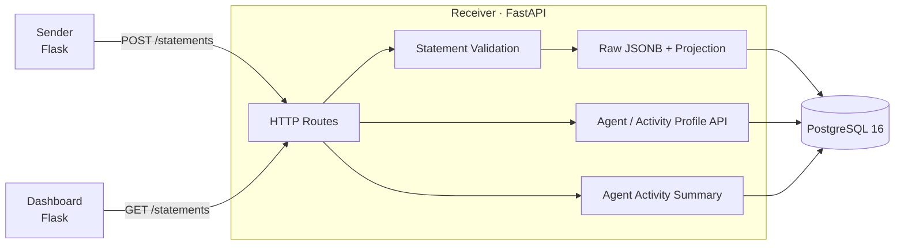
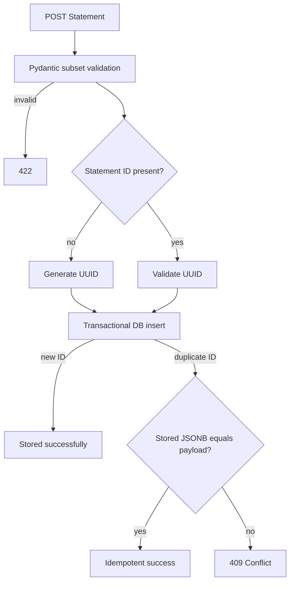
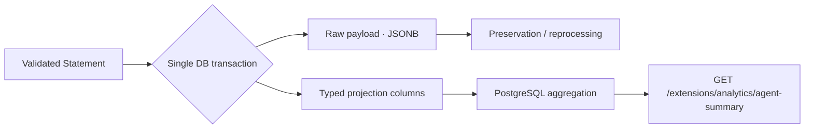

# lrs-lite

`lrs-lite` is a personal backend engineering project for revisiting the core structure of a Learning Record Store through direct implementation. It grew from my professional experience building and operating LRS systems and focuses on understanding how xAPI-shaped learning events move from ingestion to durable storage, profile documents, and analytics.

This is not a fully conformant xAPI LRS. It implements a deliberate xAPI subset with an emphasis on data integrity, HTTP concurrency, transactional consistency, and **Raw Data Preservation**.

## 1. Project Overview

The project connects the full path of a small learning-record system rather than presenting an isolated example endpoint:

- a Sender creates quiz-oriented xAPI Statements;
- a FastAPI Receiver validates and stores them;
- PostgreSQL preserves the validated Statement content as JSONB while maintaining query projections;
- Agent and Activity Profile APIs store arbitrary documents with optimistic concurrency;
- an analytics endpoint aggregates Agent activity directly in PostgreSQL;
- a Dashboard displays recently ingested Statements and their raw payloads.

The central design rule is to preserve the source event fields. Query models and analytics can evolve without rewriting the stored JSONB payload.

## 2. Architecture



| Component | Responsibility | Local port |
| --- | --- | ---: |
| Sender | Generate, preview, and submit sample Statements | `3000` |
| Receiver | Statement, Profile Document, health, and analytics APIs | `8080` |
| Dashboard | Display recent Statements from the Receiver | `3001` |
| PostgreSQL | Raw Statements, projections, migrations, and Profile Documents | `5434` |

## 3. Before / After AI Coding Agent

### Manual MVP (`manual-mvp`)

I started the project without an AI Coding Agent to reconstruct the basic LRS data flow from first principles. The manual MVP established:

- the Flask Sender and sample quiz Statements;
- the FastAPI Receiver;
- PostgreSQL JSONB storage for raw Statements;
- the Dashboard and raw-payload viewer;
- Docker Compose wiring across Sender, Receiver, Dashboard, and PostgreSQL;
- the basic `Sender → Receiver → storage → Dashboard` ingestion path.

The annotated `manual-mvp` tag marks the end of this manually implemented baseline.

### AI-assisted Enhancement

After the baseline, I used an AI Coding Agent to accelerate repository analysis, implementation, test generation, and edge-case exploration. The enhancement work addressed engineering problems that the MVP intentionally left open:

- Statement subset validation, UUID generation, and database constraints;
- idempotent retries and conflicts for reused Statement IDs;
- explicit SQL migrations and safe backfills;
- Agent and Activity Profile Document APIs;
- canonical Agent identity and owner-scoped uniqueness;
- ETag, conditional requests, JSON merge semantics, and concurrent writes;
- transactional Statement projections and Agent activity analytics;
- integration tests and a local performance check.

AI assistance did not replace ownership of the design. I reviewed the supported xAPI boundary, migration behavior, conflict semantics, transaction boundaries, canonical identity rules, indexing, and the decision not to add caching or asynchronous infrastructure.

## 4. Statement Integrity

The Receiver validates the subset produced by the current Sender: an Agent identified by `mbox`, a Verb IRI, an Activity IRI, optional Context and Result fields, score constraints, and a timezone-aware timestamp when provided. Unknown xAPI properties are retained rather than silently removed.



`statement_id` is a `UUID NOT NULL UNIQUE` column. The uniqueness constraint is the final guard against concurrent duplicate inserts; payload comparison distinguishes a safe retry from an attempt to reuse an ID for different content.

## 5. Profile Document API

The Profile implementation is a Document API rather than JSON-only CRUD.

| Resource | Methods |
| --- | --- |
| `/agents/profile` | `PUT`, `POST`, `GET`, `DELETE` |
| `/activities/profile` | `PUT`, `POST`, `GET`, `DELETE` |

Key design points:

- document bodies are stored as `BYTEA`, allowing arbitrary Content-Types;
- the original Content-Type is returned with the document;
- Agent ownership uses a canonical key independent of the display name;
- the current subset supports `mbox` and normalizes only its case-insensitive domain;
- `(resource_type, owner_key, profile_id)` is the database primary key;
- GET responses include quoted SHA-1 ETags and `Last-Modified`;
- `If-Match` protects updates based on stale content;
- `If-None-Match: *` provides create-only behavior;
- failed preconditions return `412` without modifying the document;
- JSON POST performs a top-level merge, replacing nested values rather than deep-merging them;
- a PostgreSQL transaction advisory lock serializes operations for the same document key, including concurrent creation before a row exists.

This keeps conditional-request decisions and the resulting write inside one transaction.

## 6. Raw → Projection → Analytics

The validated payload is retained in `payload JSONB` and is not rewritten by analytics. At insertion time, the Receiver derives the fields needed for queries and stores them in the same transaction:

```text
actor_key
verb_id
activity_id
event_timestamp
score_scaled
success
completion
```



This is a deliberate trade-off: JSONB retains the event fields independently of the projection, while typed columns keep the analytics query simple and indexable. No asynchronous projection pipeline or separate analytics database is required, and raw/projection consistency follows the Statement transaction.

The Agent Summary reports only directly calculable values:

- total Statement count;
- first and latest activity timestamps;
- counts by Verb and Activity;
- completion, success, and failure counts;
- average and highest `score.scaled`.

Missing scores are excluded from score aggregates but not from the total Statement count. The API does not infer attention, mastery, or other subjective learning metrics.

## 7. Performance / Engineering Decision

A small local benchmark was run with PostgreSQL in Docker:

| Measurement | Result |
| --- | ---: |
| Total Statements | 10,000 |
| Statements for the target Agent | 2,000 |
| API requests measured | 100 |
| Median | ~7.5 ms |
| p95 | ~8.8 ms |
| Core SQL execution | ~0.66 ms |

The API measurement included FastAPI TestClient processing and a real PostgreSQL connection. These are local development results, not production guarantees.

The query used `idx_statements_actor_key`, and the measured latency did not justify Redis. At this scale, cache invalidation on every new Agent Statement would add more operational and consistency complexity than value. Caching should be reconsidered only after real workload measurements show repeated Summary reads or materially slower aggregation.

## 8. Tests

Current result:

```text
46 passed
```

The test suite verifies behavior across the database and HTTP boundaries, including:

- Statement validation and generated UUIDs;
- idempotent retries and different-payload conflicts;
- UUID, uniqueness, and nullability constraints;
- migration and backfill behavior;
- Agent identity canonicalization;
- Agent and Activity Profile lifecycle operations;
- arbitrary Content-Type round trips;
- ETag and `If-Match` / `If-None-Match` preconditions;
- top-level JSON POST merge and rollback on invalid merge requests;
- database uniqueness and concurrent create serialization;
- raw JSONB and projection consistency;
- Agent separation and analytics correctness;
- scoreless Statements and idempotent analytics counts.

Integration tests run against PostgreSQL rather than replacing persistence behavior with an in-memory database.

## 9. Supported / Unsupported Scope

### Supported subset

- single-Statement `POST /statements`;
- generated or client-provided UUID Statement IDs;
- Agent actor identified by `mbox`;
- Verb and Activity IRIs;
- optional Context, Result, score, success, completion, and timestamp fields used by the Sender;
- raw JSONB storage and transactional projections;
- recent Statement listing through `GET /statements`;
- Agent and Activity Profile Document operations;
- arbitrary Profile Content-Types, ETag, `Last-Modified`, and conditional mutation;
- Profile ID listing with exclusive `since` filtering;
- Agent Activity Summary under `/extensions/analytics`.

### Intentionally unsupported

- complete xAPI conformance;
- Statement batch ingestion, Statement PUT, full retrieval filters, and voiding;
- State API;
- attachments and multipart transfer;
- full authentication and authorization;
- Agent IFIs other than `mbox` (`account`, `openid`, `mbox_sha1sum`);
- Group, SubStatement, and StatementRef support;
- complete HEAD, content-negotiation, and xAPI version-header behavior;
- the full ADL LRS conformance suite;
- Redis, message queues, background pipelines, or a separate analytics service.

## 10. Running Locally

### Prerequisites

- Docker with Docker Compose

### Start the application

```bash
cp .env.example .env
docker compose up --build
```

Open:

- Sender: [http://localhost:3000](http://localhost:3000)
- Receiver API docs: [http://localhost:8080/docs](http://localhost:8080/docs)
- Receiver health: [http://localhost:8080/health](http://localhost:8080/health)
- Dashboard: [http://localhost:3001](http://localhost:3001)

The Receiver applies the SQL migrations in `receiver/migrations` during startup. PostgreSQL data is retained in the `portfolio_data` Docker volume.

Stop the services:

```bash
docker compose down
```

### Run the tests

Start the database and create a local Python environment:

```bash
cp .env.example .env
docker compose up -d db

python3 -m venv .venv
source .venv/bin/activate
pip install -r receiver/requirements-dev.txt

set -a
source .env
set +a
export DB_HOST=127.0.0.1
export DB_PORT=5434

PYTHONPATH=receiver pytest receiver/tests -q
```

## 11. Repository History

The Git history is part of the portfolio narrative:

```text
manual-mvp
    ↓
Statement Integrity
    ↓
Agent / Activity Profile Document API
    ↓
Transactional Projection and Agent Analytics
```

`manual-mvp` is an annotated tag marking the manually implemented baseline before AI-assisted enhancement. Commits after that tag keep Statement integrity, Profile document semantics, and Analytics work separated so the progression from a direct MVP to reviewed AI-assisted engineering can be inspected in the repository itself.
